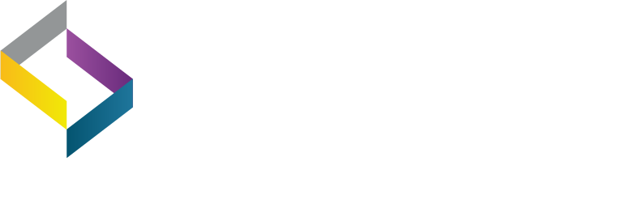

## Eskom Holdings SoC
- *Engineer In Training* | Aug'18 - Feb'19
- 
- Tags: Eskom Holdings SoC
- Badges:
  - PLC Programming [blue]
  - Control and Instrumentation [blue]
  - Ton of Processes ! [blue]
  - Ton of Documentation ! [blue]
- List Items:
  - I worked in the C&I (Control and Instrumentation) Engineering department, where our team was responsible for monitoring, controlling, and implementing plant procedures, characteristics, and automation logic. We achieved this through the support of Siemens PLCs (Programmable Logic Controllers) and by managing and delegating engineering changes.
  - The main focus was on ensuring the plant operated safely, efficiently, and effectively. We accomplished this by constantly monitoring the plant's systems and implementing necessary changes.
  - I eventually left the company due to the conditions I felt were unfavorable. Despite having a great team, I felt that the management did not prioritize the development of their EITs (Engineers in Training), especially as the company was going through some organizational troubles.

## YobiCode
- *Junior Software Engineer* | Apr'19 - Dec'21
- 
- Tags: YobiCode
- Badges:
  - .NET Core [blue]
  - C# [blue]
  - MVC [blue]
  - Microsoft SQL Server [blue]
  - Client Interaction [blue]
  - Scoping [blue]
  - Design [blue]
  - Teleric Reporting [blue]
- List Items:
  - Signa LMS (Learning management system): As this was my first experience, I was assigned to the LMS project for Signa, under the guidance of my project owner. The project had already been released as an MVP which was not fully adopted by end-users. To improve adoption, I gathered feedback, developed a roadmap, prioritized critical issues, created training materials, and provided dedicated support. With these efforts, we significantly increased the adoption rate and continued to monitor and improve the platform, according to client requirements.

## YobiCode
- *Junior Software Engineer* | Oct'19 - Dec'19
- 
- Tags: YobiCode
- Badges:
  - Balsamiq Mockups [blue]
  - Scoping [blue]
  - Design [blue]
- List Items:
  - B1SA is a company which offers supply chain management solutions and transformation services for small to large businesses, they provide a platform for companies to network, and develop business relationships with one another one of the key product they provide is BBEEE and Regulatory compliance checks for companies registered on their site as well for their clients' supply chain, which is of extreme importance in South Africa ( because of the BBEEE regulations). Some of their large clients are Toyota, Sun International, GoldFields, and TFG.
  - Coming from a legacy system built using some old tech and architecture. B1SA were looking to re-innovate their system and maintain their lead/advantage in their market. We have therefore been tasked with implementing these new changes.
  - I was responsible for scoping out the requirements necessary for the development of the new system, with the aid and guidance of my manager (who is also the director of the company). This included the following:
  - Analyzing the current web site,
  - Mapping out the business workflow and system specification.
  - Setting up meetings with stakeholders to scope the requirements for the new system and business requirements.
  - Providing feedback and refining the scope with my manager.
  - Creating UI wireframe for the new system, using Balsamiq
  - Documenting the Sofware Requirement Documents (190+ pages).
  
## YobiCode
- *Software Engineer* | Oct'20 - January'22
- 
- Tags: YobiCode
- Badges:
  - Azure [blue]
  - .NET [blue]
  - C# [blue]
  - React [blue]
  - MSSQL [blue]
  - Service Bus [blue]
  - DevOps [blue]
  - Typescript [blue]
  - xUnit test [blue]
  - Identity Server [blue]
  - AI [blue]
  - BS [blue]
- List Items:
  - I along with 3 others (including my Tech Lead) have been responsible for the development of the iSUPPLI system, which follows a semi-microservice architecture. The project for B1SA that I scoped involved the use of React running in Node.Js for our front-end, with the backend built in C# using .NET Core and a multi-tiered domain-driven design architecture. We are using MSSQL for our database management with Entity Framework for ORM. We've also built multiple separate APIs for several of the services we've developed, and are using Axios to make Http requests from the React App to the APIs interfacing the back-end.
  - We have included unit tests for most of the APIs using xUnit from .NET, and have completed the following development thus far:
  - Development of the front-end to meet the new system UI, with me responsible for building out a significant amount of the screens on the front-end.
  - Building a quoting/tendering system to allow for RFQ, where I was responsible for building out a portion of the back-end, including developing APIs, business logic, and unit tests. One of the key features here was integrating with blob storage to store and retrieve files from an Azure blob server. We also integrated with 3rd Party compliance check API providers such as Lexus Nexus to perform B-BBEE and regulatory compliance checks.
  - Developing a messaging system to allow companies to message one another within the app, where I was responsible for developing the UI for the chat messenger in the React client app, along with integration between the back-end business logic built by one of my teammates.
 - Integrating with client ERP services.
 - Integrating a payment gateway (Payfast) to allow for in-app transactions and payment, where I was responsible for setting up the .NET Core project, designing and mapping out the database requirements, creating the database context, tables, and migrations, developing APIs for the service, and integrating with the Payfast API and React front-end app.
 - Implementing and montinoring application insights for logging and maintenance.
 - This system is host in Azure with the Apps being hosted on the Azure WebApp (PAAS), where I was responsible for create the CD pipeline for continuos integration using Azure DevOps

## Immersant Data Solutions
- *Software Engineer* | Feb'21 - Present
- 
- Tags: Immersant Data Solutions
- Badges:
  - AD B2C [blue]
  - AKS [blue]
  - Docker [blue]
  - Dapper [blue]
- List Items:
  - During my time at YobiCode, unfortunately, the relationship with our clients at B1SA deteriorated for reasons that were not communicated to me. Consequently, B1SA decided to switch to another service provider, Immersant. However, I was subcontracted to assist Immersant in the onboarding process and to help them get up to speed with the projects.
  - After working with Immersant's team for several months, I was offered a permanent position as a lead role, responsible for maintaining and improving the development requirements. I gladly accepted the offer and looked forward to contributing my skills and expertise to the team's success. 
  - We have since embarked on a new project to rebuild the existing system with the intention of refining the client specification to fully meet their business requirements of the B1SA clients, while delivering a platform that is configuratable from a clients side while providing exisiting functionlaiy and improving on the achitecture. This has given me the opportunity to play a lead role, and futher improve on my knowledge and skillset, The main difference from the architectural side include swopping out the ORM entity framework for a more light weight Dapper for SQL queries, we're also using Docker with Azure AKS on an architectural side. I have also played a major role in setting out some of the coding standards as we've created all the micro service from the ground up. We've also swopped out Identity server for Azure AD B2C 
